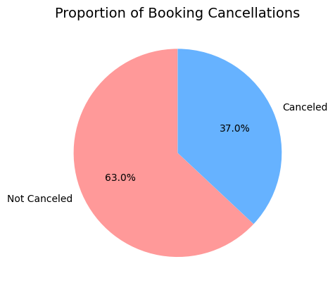

# Predicting and Reducing Booking Cancellations Through Data Science 🏨

## Project Background

In the hospitality industry, booking cancellations significantly impact revenue, operations, and resource planning. Understanding the factors contributing to cancellations can help hotels improve customer retention, optimize bookings, and enhance revenue management strategies.

## Problem Statement

The travel and hospitality industry often faces significant revenue losses due to last-minute booking cancellations, which disrupt occupancy planning and resource allocation. Understanding customer behavior and identifying high-risk bookings is essential for optimizing operations and improving profitability, and reduce revenue loss.

## Goals

- To identify primary predictors of cancellations.
- To build an accurate machine learning model that can analyze and predict cancellations.

## Objective

To develop a predictive model that identifies high-risk bookings before the scheduled arrival date, based on customer demographics and historical booking behaviour to reduce last-minute cancellations and optimize occupancy rates.

## Dataset

The dataset used for this project is a dummy [Hotel Booking Cancellation Dataset](data/hotel_data.csv)

## Data Dictionary

- **hotel:** Name of hotel
- **lead_time:** Number of days between booking date and arrival date
- **arrival_date_year:** The year of the arrival date
- **arrival_date_month:** The month of the arrival date 
- **arrival_date_week_number:** The week number of the arrival date
- **arrival_date_day_of_month:** The day of the month of the arrival date
- **stays_in_weekend_nights:** Number of weekend nights stayed or booked to stay at the hotel
- **stays_in_week_nights:** Number of week nights stayed or booked to stay at the hotel
- **adults, children, babies:** Number of guests categorized by age groups:
	- *adults:* Number of adults
	- *children:* Number of children
	- *babies:* Number of babies/infants
- **meal:** Type(s) of food option(s) included in booking package
- **country:** Customer country of origin
- **market_segment:** Customer market type (Online Travel Agents (TA), Groups, Corporate, Offline Travel Agents (TA)/Tour Operators (TO), Direct, Complementary, Aviation, Undefined)
- **distribution_channel:** Customer distribution channel (Travel Agents (TA)/Tour Operators (TO), Corporate, Direct, Global Distribution System (GDS), Undefined)
- **is_repeated_guest:** Whether customer is a repeated guest/visitor or not
- **previous_cancellations:** The number of previous bookings that were canceled by the guest
- **previous_bookings_not_canceled:** The number of previous bookings that were NOT canceled by a guest
- **reserved_room_type:** Which type room was originally reserved for each booking
- **assigned_room_type:** Which type room was finally assigned for each booking
- **booking_changes:** Number of changes made to the booking before arrival
- **deposit_type:** Type of deposit made for the booking
- **agent:** Agent ID (if applicable) involved in making the reservation
- **company:** Travel agency and/or company ID (if applicable) involved in making the reservation
- **days_in_waiting_list:** Number of days the booking was on a waiting list before it was confirmed or canceled
- **customer_type:** Type of customers (Transient, Contract, Transient-Party, Group)
- **adr:** Average daily rate per room, calculated by dividing the sum of all lodging transactions by the total number of staying nights
- **required_car_parking_spaces:** The number of car parking spaces the booking required
- **total_of_special_requests:** The number of special requests made
- **reservation_status:** Reservation status (Check-Out, Canceled, No-Show)
- **bookingID:** Booking ID

## Target

- **is_canceled:** Cancellation Status (Binary)

## Project Highlights

**Data Exploration and Visualization:** Conducted exploratory data analysis (EDA) to analyze trends in cancellation status and understand factors that might affect cancellation status.

**Feature Engineering:** Identified and engineered relevant features, such as number of total guests, number of total nights, total profit, whether the guests get the same room assigned as they reserved, and arrival date information (to check validity).

**Modeling:** Implemented and evaluated multiple machine learning models, including Logistic Regression (base model), Decision Trees, Random Forest, and XGBoost, to predict customer churn.

**Feature Importance Analysis:** Utilized feature importance metrics to highlight significant predictors of cancellations, leading to actionable insights for business strategies.

## Exploratory Data Analysis

### Overall Trend

**Insight:** The average price per room varies by room type, with it generally being higher during the summer months. This increase in price is largely driven by higher demand, as many people travel during summer breaks, school vacations, and peak tourism seasons. This seasonal pricing trend reflects hotels’ efforts to maximize revenue during periods of high occupancy.

However, during the spring season, there is a notable increase in cancellation rates, likely due to factors such as unpredictable weather or changes in travel plans. Additionally, cancellations were particularly high in 2019 due to the onset of the pandemic, which significantly disrupted travel plans and led to a surge in hotel cancellations.

### Top 10 Countries of Guests Who Cancels 

**Insight:** A very large portion of the customers who cancel is from Portugal and other European countries. This could reflect economic or political situations in the country which needs to be investigated further.

### Proportion of Booking Cancellations

**Insight:** Although there is a low cancellation rate of 36.9% compared to 63.1% non-cancellations, indicating most bookings are fulfilled, it is still significant enough to impact revenue and operations. There may be underlying issues, such as customer uncertainty, which needs to be investigated further.

### Cancellation Status by Market Segment

**Insight:** Groups market segment has a higher chance of cancelling than other market segments, likely due to the clashing complexity of group travel plans. Addressing flexible options to mitigate this.

### Cancellation Status by Deposit Type

**Insight:** Customers who paid a non-refundable deposit type tend to have higher cancellation rates. "No Deposit" may often be part of guaranteed stays or reservations closer to the travel date.

### Lead Time by Cancellation Status

**Insight:** Customers who cancel have longer lead times as bookings made far in advance are more prone to changes or cancellations due to evolving plans or unforeseen circumstances.

### Total Number of Previous Cancellations by Cancellation Status

**Insight:** The higher the number of previous cancellations, the greater the likelihood of a booking being canceled again. This pattern may be due to a lack of commitment from these customers or frequent changes in their travel plans.

## Data Pre-Processing

1. Data Wrangling involved data cleaning such as fixing data quality (types, duplicates, and missing).
- Data was validated (drop invalid dates and number of guests)
- There were no duplicated data.
- Missing data were handled as follows:
	- Drop company column since it has >50% missing and therefore low relevance
	- Fill in `children` with 0.0 for no children
	- Fill in `country` with the mode (most common value)
	- Fill in `agent` with 0.0 for direct bookings
2. Feature Selection and Engineering involved:
- Dropping the arrival information which indicates that a booking is not canceled.
- Dropping the `bookingID` and `country` coulumns as they only contain identification and are therefore irrelevant to the prediction.
- Dropping the `assigned_room_type` column, as a room is only assigned when a guest checks in which means a booking is not canceled.
- Dropping the `reservation_status` and `reservation_status_date` columns, as they contain information about the target variable which causes data leakage.
- Dropping the `stays_in_weekend_nights`, `stays_in_week_nights`, `adults`, `children`, `babies`, `total_nights`, `total_guests`, `profit` and `adr` columns which are multicollinerated to avoid overrepresentation.
- Encoding categorical variables (`meal`, `market_segment`, `distribution_channel`, `reserved_room_type`, `deposit_type`, `customer_type`) using one hot encoding 
3. The data was then split into 80% train: 20% test ratio for modelling
4. The train dataset were also checked:
- Robust scaler were used to standardized the data.

## Model Selection and Analysis

The Base Random Forest model demonstrated strong performance across key metrics, including precision, F1-score, and the highest ROC-AUC on the test data, making it the best initial choice for classification. However, to further reduce overfitting and enhance the model's ability to generalize to unseen data, Random Search Cross-Validation was conducted. This process systematically tuned the hyperparameters of the Random Forest, improving its balance between bias and variance.

The final optimized model showed a significant improvement, achieving an F1-score of 78.88% and an ROC-AUC of 92.14% on the test data. These results highlight the model’s strong ability to predict accurately while maintaining reliable class separation, confirming it as the most robust and effective choice for this classification task.

The model accurately predicted 9,520 non-cancellations and 4,624 cancellations, with 920 false positives (non-cancellations predicted as cancellations) and 1,556 false negatives (cancellations predicted as non-cancellations). This indicates good overall performance but highlights room for improvement in identifying cancellations.

## Features Importances

- Lead Time: Longer lead times likely correlate with higher cancellation rates, as customers might book far in advance and change plans.
- Total of Special Requests: Guests making special requests might have a clearer intent to stay, lowering their cancellation probability.
- ADR (Average Daily Rate): Higher ADR bookings may lead to cancellations if customers find cheaper alternatives.
- Agent: Different agents may cater to different customer profiles.
- Previous Cancellations: Guests with a history of cancellations are at a higher risk of repeating the behavior.

## Recommendations

1. **Targeted Customer Communication**
Since lead time is the most important feature, focus on reducing the likelihood of cancellations for bookings made far in advance. Implement reminders or incentives (e.g., discounts, flexible policies) to retain these customers, especially for those booking from Portugal and other European countries, as they account for the majority of cancellations.
2. **Leverage Special Requests**
With special requests being a significant factor, hotels should optimize their response to these requests. Quick confirmation and excellent service for customers making multiple requests can reduce cancellations by improving satisfaction and perceived value.
3. **Adjust Pricing Strategies**
As the average daily rate (ADR) is a key factor, monitor and adjust pricing dynamically to align with demand and competitor pricing. Offer competitive rates for customers from high-cancellation regions like Portugal and Europe, particularly for advanced bookings, to encourage commitment.

## Thank You 🔥
